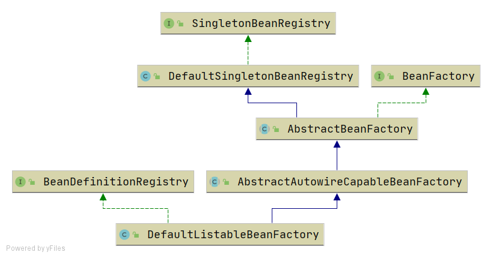
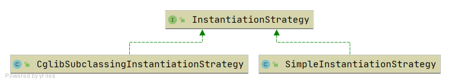
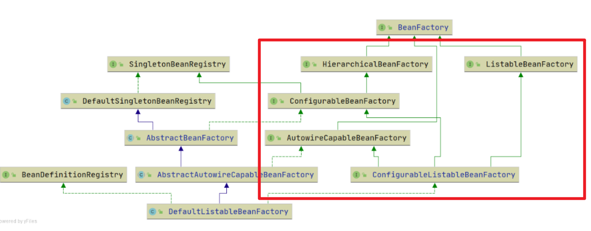
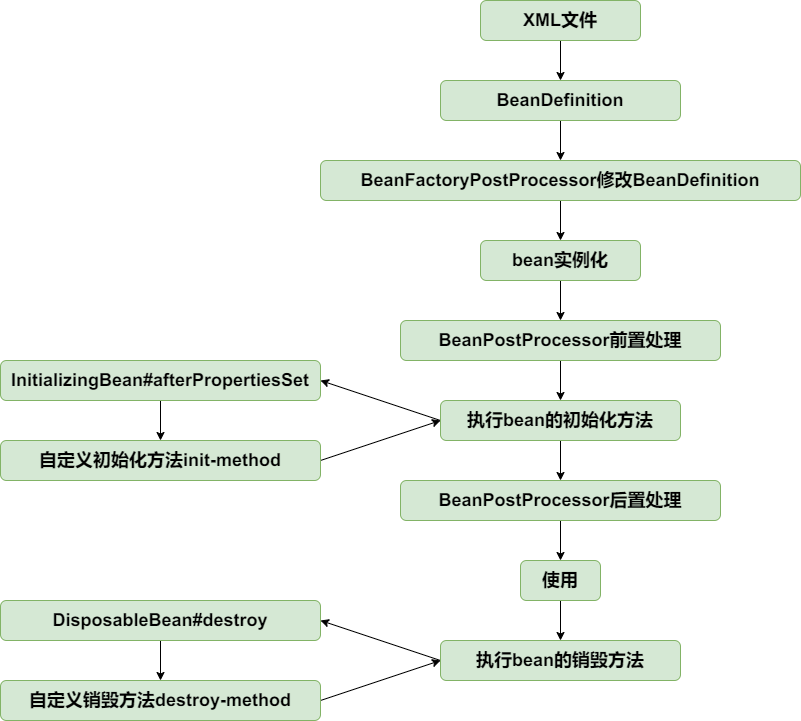
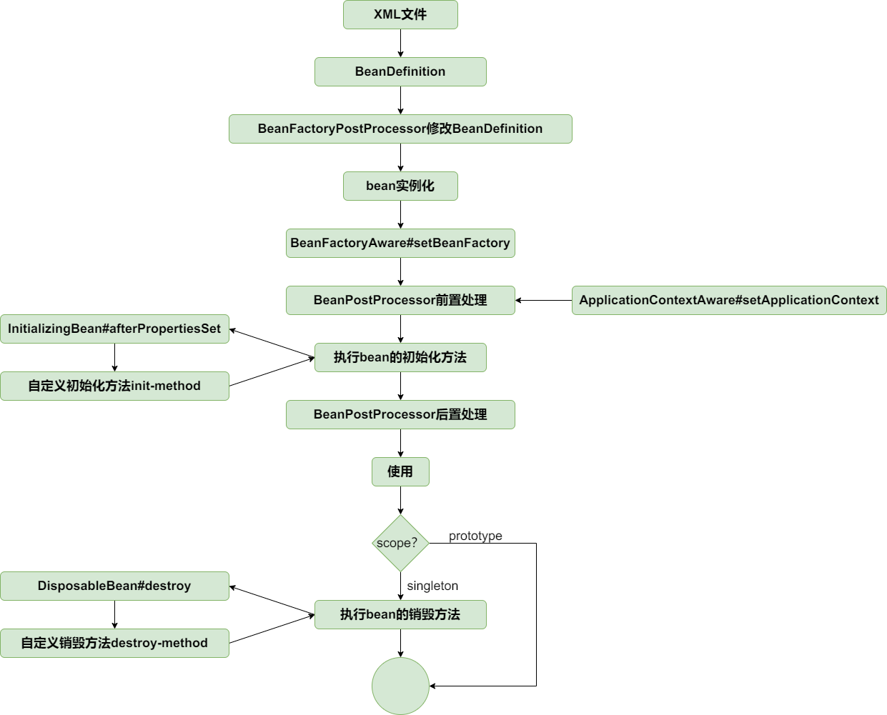

# 基础篇：IOC  

## 最简单的bean容器  

定义一个 Map，然后一个 register（也就是put）和一个getBean（也就是get）


## BeanDefinition和BeanDefinitionRegistry

我参考原文档中的这张图，从上往下依次构建：

  

- 相比最开始的一个map，这里改为两个新Map分别用来存储 BeanDefinition 和 Bean 的单例
- 将 Bean 相关信息存储进 BeanDefinitions 中后，当需要这个实例时，会使用 `getSingleton()` 方法，进入第二个Map中查找是否有，没有就通过 `beanClass.newInstance()` 方法由反射创建，而后加入Map并返回

## Bean 实例化策略 InstantiationStrategy

上一节的实例方法 `beanClass.newInstance()` 只适用于无参构造，所以要优化，抽象出实例化策略接口 `InstantiationStartegy`  

两种 `newInstance()`

| 特性             | `Class.newInstance()`                                     | `Constructor.newInstance()`                       |
| ---------------- | --------------------------------------------------------- | ------------------------------------------------- |
| 💡 来源           | `Class` 类的方法                                          | `Constructor` 类的方法                            |
| 🎯 调用的构造方法 | 只能调用 **无参构造器**                                   | 可以调用 **任意参数构造器**                       |
| ⚠️ 异常类型       | 抛出 `InstantiationException` 和 `IllegalAccessException` | 抛出 `InvocationTargetException`                  |
| 🛠 灵活性         | 较低，只适用于无参构造函数                                | 高，可选具体构造器并传参                          |
| 🔒 可见性要求     | 构造器必须是 public                                       | 可通过 `setAccessible(true)` 访问非 public 构造器 |



- SimpleInstantiationStrategy，使用bean的构造函数来实例化
- CglibSubclassingInstantiationStrategy，使用CGLIB动态生成子类
  - 当 BeanDefinition中包含 `lookup-method` 或 `replace-method` 时，Spring 无法直接通过构造器或工厂方法实例化对象，而是需要通过 **CGLIB 动态生成子类**，覆盖指定方法以实现注入逻辑。
  - 目前 BeanDefinition 中只有 Class 信息，所以这个实例化方法暂时用不到


新建了以上的三个文件，并修改了 AbstractAutowireCapableBeanFactory，在其中加入了策略的默认值以及调用。  


## 为 Bean 填充属性  

> 分支 04

- POM中添加了hutool  
- BeanDefinition 中添加了 propertyValues 这个属性  
- 定义了 propertyValue 包含 name 和 value  
- 定义了 propertyValues 为数组类型的pv
- 在 AbstractAutowireCapableBeanFactory中bean后添加了applyPropertyValue  

具体填充属性的方法就是用反射，hutool中有BeanUtil这个东西

具体变化可以通过 diff <branch1> <branch2> 来对比前后，为了方便查找，每次都会有序号

## 为 Bean 注入 Bean

> 分支05  

增加BeanReference类，包装一个bean对另一个bean的引用。实例化beanA后填充属性时，若PropertyValue#value为BeanReference，引用beanB，则先去实例化beanB。
由于不想增加代码的复杂度提高理解难度，暂时不支持循环依赖，后面会在高级篇中解决该问题。

## 资源和资源加载器  

> 分支06  

这一节应该是为了下一节的xml做准备  

- 资源  
  - ClassPathResource:

    - ```java
      InputStream is = this.getClass().getClassLoader().getResourceAsStream(this.path);
      ```
  
  - FileSystemResource：
  
    - ```java
    Path path = new File(this.filePath).toPath();
    return Files.newInputStream(path);
  
  - UrlResource
  
    - ```java
      return urlConnection.getInputStream();
      ```
  
- 资源加载器

  - ResourceLoader接口则是资源查找定位策略的抽象，
  - DefaultResourceLoader是其默认实现类

## 在 xml 文件中定义 bean

> 分支07  

要实现“在 xml 中定义 bean”，需要这几个东西：

- 资源加载器 —— 上一节实现的  
- 抽象出读取bean定义信息的接口（BeanDefinitionReader），同时承担读取信息后的注册功能。以及对应的抽象实现类（AbstractBeanDefinitionReader）以及抽象实现类的实现类（XmlBeanDefinitionReader）
  - **当前**从xml读取的是String类型，所以属性也就是String或引用其他bean，后续会有类型转换器  
- 调整BeanFactory结构，相比于此前的内容新增了如下框内的东西，



- `BeanFactory`：提供最基础的获取`bean`信息的方法，如`getBean()`。
  - `HierarchicalBeanFactory`：扩展 BeanFactory，提供**父子层级**Spring容器的基础方法，如`getParentBeanFactory()`。
    - `ConfigurableBeanFactory`：扩展 HierarchicalBeanFactory，提供对容器配置的控制。如`addBeanPostProcessor()`。
  - `ListableBeanFactory`：扩展 BeanFactory，提供了**批量查询** bean 的能力，适合列举容器中的 bean，如`getBeansOfType()`。
  - `AutowireCapableBeanFactory`：扩展 BeanFactory，提供**自动装配**和 bean **生命周期**的细粒度控制，如`createBean()`。
- `ConfigurableListableBeanFactory`：综合 ListableBeanFactory 和 ConfigurableBeanFactory 的功能，提供获取和修改`BeanDefinition`、预实例化单例对象的功能。如`getBeanDefinition()`。
- `SingletonBeanRegistry`：定义**单例 bean** 的注册和获取接口，用于管理单例 bean，ConfigurableBeanFactory 继承了此接口。
- `BeanDefinitionRegistry`：提供注册和移除 bean 定义的功能，用于动态修改 bean 定义，ConfigurableListable beanFactory 实现此接口。


## BeanFactoryPostProcessor和BeanPostProcesser  

> 分支08-bean-factory-post-processor-and-bean-post-processor 

根据原文档：

> BeanFactoryPostProcessor和BeanPostProcessor是spring框架中具有重量级地位的两个接口，理解了这两个接口的作用，基本就理解spring的核心原理了。为了降低理解难度分两个小节实现。

- BeanFactoryPostProcessor是spring提供的容器扩展机制，允许我们在bean实例化之前修改bean的定义信息即BeanDefinition的信息。
  - 在`getBean()`执行之前，修改的是propertyValues，采用的是直接覆盖  
- BeanPostProcessor也是spring提供的容器扩展机制，不同于BeanFactoryPostProcessor的是，BeanPostProcessor在bean实例化后修改bean或替换bean。BeanPostProcessor是后面实现AOP的关键。
  - 在`getBean()`执行时，填充属性之后，会遍历postBeanProcessors，Processor可以调用对象内定义的方法来修改属性  


- applyBeanPostProcessorsBefore/AfterInitialization是定义在AutowireCapableBeanFactory下的  
- addBeanPostProcessor是定义在ConfigurableBeanFactory下的  
- 为什么会这样呢？
  - applyBeanPostProcessorBefore/AfterInitialization 定义在 AutowireCapableBeanFactory 中，因为它们负责 bean 初始化阶段的动态处理，属于 bean 生命周期管理的核心逻辑。
  - 而 addBeanPostProcessor 定义在 ConfigurableBeanFactory 中，因为它是一个配置操作，负责向容器注册后处理器。这种设计体现了 Spring 的职责分离和层次化设计原则，使得框架更加模块化、灵活且易于维护。
  - 理解上，重点其实是 “Initialization”导致它们分开了
  - 每个接口具体的功能可以参考上一节

## 应用上下文ApplicationContext  

> 分支09-application-context  

文档原文写的很好，我直接拿过来：

> 应用上下文ApplicationContext是spring中较之于BeanFactory更为先进的IOC容器，ApplicationContext除了拥有BeanFactory的所有功能外，还支持特殊类型bean如上一节中的BeanFactoryPostProcessor和BeanPostProcessor的自动识别、资源加载、容器事件和监听器、国际化支持、单例bean自动初始化等。
>
> BeanFactory是spring的基础设施，面向spring本身；而ApplicationContext面向spring的使用者，应用场合使用ApplicationContext。

总的来说，就是把之前手动做的，这里全都自动做了，有种封装的感觉

关键函数：`AbstractApplicationContext#refresh`

```java
@Override
public void refresh() throws BeansException{
    //创建BeanFactory，并加载BeanDefinition
    refreshBeanFactory();
    ConfigurableListableBeanFactory beanFactory = getBeanFactory();

    //在bean实例化之前，执行BeanFactoryPostProcessor
    invokeBeanFactoryPostProcessors(beanFactory);

    //BeanPostProcessor需要提前与其他bean实例化之前注册
    registerBeanPostProcessors(beanFactory);

    //提前实例化单例bean
    beanFactory.preInstantiateSingletons();

}
```

从bean的角度看，目前生命周期如下：


## bean的初始化和销毁方法  

> 分支：10-init-and-destroy-method  

> 在spring中，定义bean的初始化和销毁方法有三种方法：
>
> - 在xml文件中制定init-method和destroy-method
> - 继承自InitializingBean和DisposableBean
> - 在方法上加注解PostConstruct和PreDestroy
>
> 第三种通过BeanPostProcessor实现，在扩展篇中实现，本节只实现前两种。
>
> 针对第一种在xml文件中指定初始化和销毁方法的方式，在BeanDefinition中增加属性initMethodName和destroyMethodName。
>
> 初始化方法在AbstractAutowireCapableBeanFactory#invokeInitMethods执行。DefaultSingletonBeanRegistry中增加属性disposableBeans保存拥有销毁方法的bean，拥有销毁方法的bean在AbstractAutowireCapableBeanFactory#registerDisposableBeanIfNecessary中注册到disposableBeans中。
>
> 为了确保销毁方法在虚拟机关闭之前执行，向虚拟机中注册一个钩子方法，查看AbstractApplicationContext#registerShutdownHook（非web应用需要手动调用该方法）。当然也可以手动调用ApplicationContext#close方法关闭容器。

几个点注意一下：

初始化方法： afterPropertySet() 执行后，再执行自定义的init-method

销毁方法：先执行继承的destroy()，后执行自定义  

为了确保销毁方法在虚拟机关闭之前执行，向虚拟机中注册一个钩子方法：AbstractApplicationContext#registerShutdownHook

- 到此为止，bean的生命周期如下：




## Aware 接口  

> 分支11-aware-interface

正如文档所说，这个接口是标记类接口，实现它的类可以获得容器的相关信息，比如这里实现的两个常用的`BeanFactoryAware` 以及 `ApplicationContextAware`  


要在实现接口的类里面添加对应的属性，并定义set函数，感知beanFactory可以在initializeBean进行，通过直接判断，

感知ApplicationContext则需要beanPostProcessor，会在开始添加处理器，处理器会对实现ApplicationContextAware的bean调用对应的set


更新的生命周期：

  


## bean作用域，增加prototype

> 分支12-prototype-bean  

在 Spring 中，`singleton` 和 `prototype` 是两种常见的 Bean 作用域，它们决定了容器如何创建和管理 Bean 实例。下面是它们的核心区别：

| 特性       | `singleton`                    | `prototype`                                 |
| ---------- | ------------------------------ | ------------------------------------------- |
| 实例数量   | 每个 Spring 容器中只有一个实例 | 每次请求都会创建一个新实例                  |
| 生命周期   | 容器启动时创建，容器关闭时销毁 | 每次调用 `getBean()` 时创建，容器不负责销毁 |
| 默认作用域 | 是                             | 否（需显式声明）                            |
| 适用场景   | 无状态 Bean（如 DAO、Service） | 有状态 Bean（如用户会话、临时数据）         |

实现的关键点：

BeanDefinition 中添加新属性判断是否为单例  

提前实例化环节通过新属性判断是否进行实例化  

getBean 通过新属性判断实例化后是否加入singleton的map里面  

registerDisposableBeanIfNecessary方法中通过新属性判断prototype作用域bean不执行销毁方法

至止，bean的生命周期如下：



## FactoryBean  

> 分支13-factory-bean

在 Spring 中，`FactoryBean` 是一个非常特别的接口，它的作用是**定制 Bean 的创建过程**，尤其适用于那些初始化逻辑复杂、需要动态生成或代理的对象。

在getBean时处理逻辑与常规bean产生分化  

新加了一个缓存`factoryBeanObjectCache`用于存储由FactoryBean制造的bean

## 容器事件和事件监听器  

> 分支14-event-and-event-listener

`applicationEventMulticaster`中包含了一个集合用来存储Listeners；

事件通过 `applicationEventMulticaster.multicastEvent(event);` 进行广播

广播的具体方式是遍历监听器集合，通过`supportsEvent(applicationListener, event)`来确定某个监听器(`ApplicationListener<ApplicationEvent>`）是否对该事件“感兴趣”（support函数的作用是如果event是ApplicationEvent或其子类，则返回true）

# 基础篇：AOP  

## 切点表达式  

> 分支15-pointcut-expression  

Joinpoint，织入点，指需要执行代理操作的某个类的某个方法(仅支持方法级别的JoinPoint)；Pointcut是JoinPoint的表述方式，能捕获JoinPoint。

最常用的切点表达式是AspectJ的切点表达式。需要匹配类，定义ClassFilter接口；匹配方法，定义MethodMatcher接口。PointCut需要同时匹配类和方法，包含ClassFilter和MethodMatcher，AspectJExpressionPointcut是支持AspectJ切点表达式的PointCut实现，简单实现仅支持execution函数。

**解析 AspectJ 表达式** → `execution(* com.xxx..*(..))`

**实现 Pointcut 接口** → 提供给 Spring AOP 使用

**同时扮演 ClassFilter & MethodMatcher** → 能判断类和方法是否匹配

---

POM中引入了两个模块：

- **aopalliance:aopalliance:1.0**  
  - **AOP Alliance（AOP 联盟）接口标准库**。
  - 它是早期 Java 社区为 AOP 定义的一套**统一接口规范**（类似 JDBC 之于数据库）。
- **org.aspectj:aspectjweaver:1.8.0**
  - **AspectJ 的核心织入库**。
  - 它负责在运行时或类加载时，把切面代码 **织入（weave）** 到目标类里。
  - 实现了 AspectJ 的 `@Aspect` 注解支持。


## 基于 JDK 的动态代理  

> 分支16-jdk-dynamic-proxy  

各种信息通过 `AdvisedSupport` 进行封装，然后``JdkDynamicAopProxy` 调用 **Java反射包**中的

```java
@NotNull
public static Object newProxyInstance(
    ClassLoader loader,
    @NotNull   Class<?>[] interfaces,
    @NotNull   java.lang.reflect.InvocationHandler h
)
```

所以叫 “基于**JDK**的动态代理”  


## 基于CGLIB的动态代理  

> 分支17-cglib-dynamic-proxy

与基于JDK的动态代理在运行期间为接口生成对象的代理对象不同，基于CGLIB的动态代理能在运行期间动态构建字节码的class文件，为类生成子类，因此被代理类不需要继承自任何接口。

核心在这：

`CglibAopProxy#getProxy()`

```java
enhancer.setSuperclass(target.getClass()); // 父类是目标类
enhancer.setInterfaces(ts.getTargetClass()); // 可选：附加接口
```


更具体的对比两种代理可以查看[[附录这里]](#通过`TargetSource#getTargetClass()` 来区分两种动态代理  )


构建时遇到了这个错误

```exception
Caused by: java.lang.reflect.InaccessibleObjectException: 
Unable to make protected final java.lang.Class java.lang.ClassLoader.defineClass(...)
accessible: module java.base does not "opens java.lang" to unnamed module
```

是因为CGLIB 在底层用反射调用 `ClassLoader#defineClass` 来生成代理类，但 **JDK 9+ 的模块化机制**（JPMS）默认不允许随便反射访问 `java.lang.ClassLoader` 的受保护方法。

人话就是版本高了，下个低版本的SDK装上就行（用高版本SDK但改语言级别没用）

## AOP代理工厂  

> 分支18-proxy-factory

巨简单，增加AOP代理工厂ProxyFactory，由AdvisedSupport#proxyTargetClass属性决定使用JDK动态代理还是CGLIB动态代理。


# 附录

### 类型判断相关  

```java
if (obj instanceof MyClass) {
    // obj 是 MyClass 或其子类的实例
}
```

| 特性     | `instanceof`             | `isAssignableFrom`                     |
| -------- | ------------------------ | -------------------------------------- |
| 比较的是 | 对象 和 类型             | 类型 和 类型                           |
| 示例     | `obj instanceof A`       | `A.class.isAssignableFrom(B.class)`    |
| 判断方向 | obj 是 A 的实例吗？      | B 是否是 A 的子类或实现类？            |
| 用途     | 安全地强制类型转换前判断 | 动态分析类的继承关系、适配类型         |
| 常见场景 | 多态下做对象识别         | 反射、泛型、框架注册时做类型兼容性判断 |

### 通过`TargetSource#getTargetClass()` 来区分两种动态代理  

`getTargetClass()` 的定义

```java
public class TargetSource {
    private final Object target;

    public TargetSource(Object target) {
        this.target = target;
    }

    public Class<?>[] getTargetClass() {
        return this.target.getClass().getInterfaces();
    }

    public Object getTarget() {
        return this.target;
    }
}
```

`getTargetClass()` **不是返回目标对象的 Class 本身**，而是返回目标对象实现的所有接口（`Class<?>[]`）。

为什么？

- 因为 JDK 动态代理只能基于接口生成代理类。
- 所以如果你走 JDK 动态代理，就得知道目标对象有哪些接口。

对于 CGLIB 代理，通常用的是 `setSuperclass(target.getClass())`，就不依赖接口了

